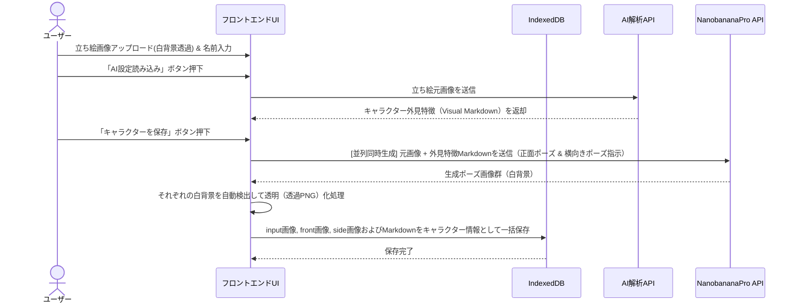
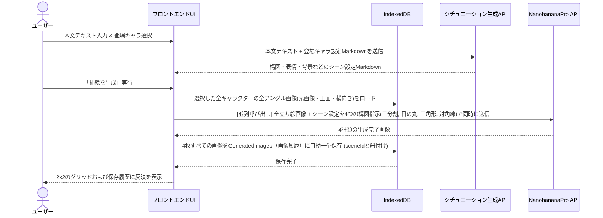
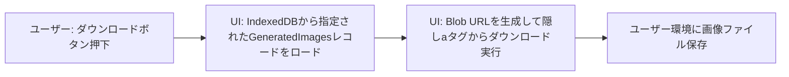

# 01_基本設計

## 1. システム構成・動作環境
本システムは、ローカルPC（Localhost）上で動作するWebベースのSPA（シングルページアプリケーション）として構築します。データはすべてブラウザ内のデータベースに保存され、サーバーへのデータ送信はNanobananaPro等のAPI通信のみに限定されます。

- **実行環境**: ローカルPCブラウザ（Chrome推奨）
- **サーバー起動元**: Node.js (Next.js 開発サーバー)
- **公開形態**: ローカル利用専用（非公開）

## 2. 技術スタック
- **実行プラットフォーム**: Node.js
- **UIフレームワーク**: Next.js (React)
- **フロントエンド言語**: TypeScript / JavaScript (ES6+)
- **スタイル（CSS）**: Vanilla CSS (CSS Modules / CSSカスタムプロパティを用いたモダンデザイン)
- **ローカルデータベース**: IndexedDB (画像のバイナリデータおよびテキストデータを大容量保存するため)
- **API通信**:
  - **画像生成**: NanobananaPro API (Google AI Studio経由 / モデルID: `gemini-3-pro-image-preview` ※利用にはGoogle CloudプロジェクトのBilling有効化が必要)
  - **AIプロファイル/シチュエーション生成**: Gemini API (Google AI Studio経由 / モデルID: `gemini-3.6-flash` または `gemini-3.6-pro`)

## 3. データモデル（データベース設計）

### 3.1 Novels (小説情報)
| フィールド名 | 型 | 説明 |
| :--- | :--- | :--- |
| `id` | String (UUID) | 小説プロジェクト識別子 |
| `title` | String | 小説タイトル (例: 「AI事務員宮西さん」) |
| `description` | String | 小説のあらすじ・概要・メモ |
| `createdAt` | DateTime | 作成日時 |
| `updatedAt` | DateTime | 更新日時 |

### 3.2 Characters (キャラクター情報)
| フィールド名 | 型 | 説明 |
| :--- | :--- | :--- |
| `id` | String (UUID) | キャラクター識別子 |
| `novelId` | String (UUID) | 関連する小説ID (外部キー) |
| `name` | String | キャラクター名 |
| `images` | Object | 各ポーズの立ち絵画像データを保持するマップオブジェクト - `input`: String (元画像Base64 - 必須) - `front`: String (正面ポーズBase64 - 任意) - `side`: String (横向きポーズBase64 - 任意) |
| `characterVisual` | String | AI解析による外見特徴MD（最大2万文字、ユーザー編集可能。構成: #名前-外見特徴, ##1.基本ビジュアル[性別], ##2.詳細ビジュアル[髪型・髪色/瞳の色/服装/その他特徴]） |
| `characterProfile` | String | ユーザー手動入力による設定MD（最大2万文字、ユーザー編集可能。構成: #名前-詳細設定, ##1.プロフィール[年齢/職業], ##2.キャラクター性[性格/能力/補足]） |
| `createdAt` | DateTime | 作成日時 |
| `updatedAt` | DateTime | 更新日時 |

### 3.3 Scenes (シーン・挿絵生成情報)
| フィールド名 | 型 | 説明 |
| :--- | :--- | :--- |
| `id` | String (UUID) | シーン識別子 |
| `novelId` | String (UUID) | 関連する小説ID (外部キー) |
| `name` | String | シーン名 |
| `text` | String | シーン文章（小説の本文テキスト） |
| `characterIds` | Array<String> | 登場キャラクターのIDリスト |
| `aiSituation` | String | シーン設定MD（最大2万文字、ユーザー編集可能。構成: #シーン設定概要, ##1.登場人物と状態[登場キャラ/表情/ポーズ], ##2.構図・カメラワーク[アングル/配置/視線], ##3.背景・環境[場所/時間・天候/光源/雰囲気]） |
| `createdAt` | DateTime | 作成日時 |
| `updatedAt` | DateTime | 更新日時 |

### 3.4 GeneratedImages (生成された画像履歴)
| フィールド名 | 型 | 説明 |
| :--- | :--- | :--- |
| `id` | String (UUID) | 画像識別子 |
| `sceneId` | String (UUID) | 関連するシーンID (外部キー) |
| `image` | Blob / DataURL | NanobananaProによって生成された画像データ |
| `createdAt` | DateTime | 生成日時 |
| `updatedAt` | DateTime | 更新日時 |

---

## 4. データフロー設計

### 4.1 キャラクター登録・別ポーズ追加生成（アドオン）フロー

### 4.2 挿絵生成（4構図並列生成 ＆ 比較選択採用）フロー

### 4.3 クライアントへのダウンロードフロー

